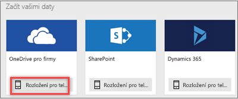
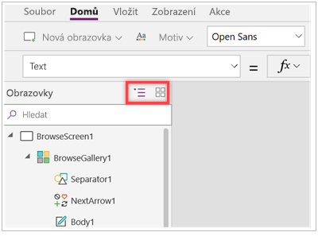
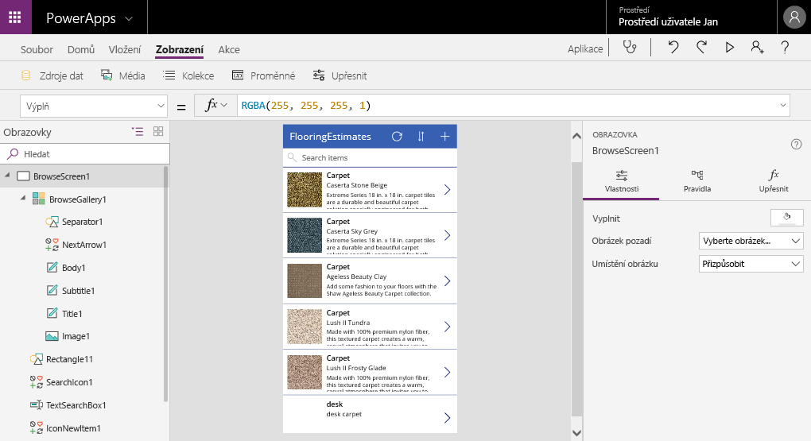

Pusťme se do toho.OK, let's get started.

Když teď znáte všechny části Microsoft PowerApps a možnosti pro vytváření aplikací, je čas nějakou aplikaci vytvořit.Now that you're familiar with all the parts of Microsoft PowerApps and the options for creating apps, it's time to actually build an app. V této lekci vygenerujete aplikaci pro telefon, jejímž zdrojem dat je sešit Microsoft Excelu uložený v Microsoft OneDrivu pro firmy.In this unit, you'll generate a phone app where the data source is a Microsoft Excel workbook that's stored in Microsoft OneDrive for Business. Tento excelový sešit obsahuje vzorky podlahových krytin společnosti, včetně jejich obrázků a cen.This Excel workbook lists a company's inventory of flooring samples with pictures and prices.

Mějte na paměti, že můžete použít data z mnoha jiných zdrojů, včetně Microsoft SharePointu, cloudových služeb jako Salesforce a místních zdrojů jako Microsoft SQL Server.Keep in mind that you can use data from lots of other sources, including Microsoft SharePoint, cloud services like Salesforce, and on-premises sources like Microsoft SQL Server.

> [!NOTE]
> Tento tok bude fungovat jenom v případě, že máte licenci pro Office 365 a požadovanou licenci Dynamics 365 nebo bezplatnou zkušební verzi Dynamics 365.This flow will work only if you have a license for Office 365 and the required Dynamics 365 license or free Dynamics 365 trial. Podívejte se na další informace o tom, které [produkty Microsoft zahrnují Microsoft PowerApps a Microsoft Flow](https://docs.microsoft.com/powerapps/administrator/pricing-billing-skus#licenses).Learn more about which [Microsoft products include Microsoft PowerApps and Microsoft Flow](https://docs.microsoft.com/powerapps/administrator/pricing-billing-skus#licenses).”

## Připojení ke zdroji datConnect to a data source

1. Stáhněte si [sešit Flooring Estimates](https://az787822.vo.msecnd.net/documentation/get-started-from-data/FlooringEstimates.xlsx) a uložte si ho do OneDrivu pro firmy.Download the [Flooring Estimates workbook](https://az787822.vo.msecnd.net/documentation/get-started-from-data/FlooringEstimates.xlsx), and save it to OneDrive for Business.

1. Přejděte na [https://web.powerapps.com](https://web.powerapps.com) a přihlaste se pomocí účtu organizace.Go to [https://web.powerapps.com](https://web.powerapps.com), and sign in with your organizational account.

1. V levém podokně vyberte **Aplikace**.In the left pane, select **Apps**.

1. V rozevírací nabídce vyberte **Aplikace plátna od začátku**.Select **Canvas app from blank** from the dropdown menu

1. Vyberte **Vytvořit aplikaci**.Select **Create an app**. 
1. Pro zdroj dat **OneDrive pro firmy** vyberte **Rozložení pro telefon**.For the **OneDrive for Business** data source, select **Phone layout**.

    

    Vygenerované aplikace jsou vždy založené na jednom seznamu nebo tabulce, ale další data můžete do aplikace přidat později.Generated apps are always based on a single list or table, but you can add more data to the app later. Následující tři kroky vysvětlují postup připojení k excelovému sešitu.The next three steps explain how to connect to the Excel workbook.

1. V části **Připojení** vyberte **OneDrive pro firmy**.Under **Connections**, select **OneDrive for Business**.

    Je možné, že abyste viděli připojení **OneDrive pro firmy**, budete muset vybrat **Nové připojení**.You may need to select **New Connection** to see the **OneDrive for Business** connection.
1. Vyberte **Vytvořit**.Select **Create**.
1. V části **Zvolit excelový soubor** vyberte excelový sešit.Under **Choose an Excel file**, select the Excel workbook.
1. Vyberte **Připojit**.Select **Connect**.

PowerApps vygeneruje aplikaci tak, že zkontroluje vaše data a vyhodnotí odpovídající možnosti PowerApps, abyste získali funkční aplikaci jako výchozí bod.PowerApps generates the app by inspecting your data and matching it with PowerApps capabilities so that you get a working app as a starting point.

Mějte prosím na paměti, že abyste se dostali do PowerApps Studia, musíte zvolit náhled aplikace.Please note that you have to choose to preview the app before you can get to the PowerApps Studio.

## Prozkoumání vygenerované aplikaceExplore the generated app
Výborně!Success! Vaše nová tříobrazovková aplikace se otevře v PowerApps Studiu.Your new three-screen app opens in PowerApps Studio.

Na levé straně uvidíte podokno **Obrazovky**.On the left, you'll see the **Screens** pane. V pravém horním rohu podokna obrazovek vyberte zobrazení miniatur.In the upper-right corner of the screens pane, select the thumbnail view.

Vybráním miniatury pro každou obrazovku zobrazíte ovládací prvky na této obrazovce.Select the thumbnail for each screen to view the controls on that screen. 

Tady je hlavní vývojářské okno PowerApps Studia, o kterém se dozvíte více v pozdějších modulech.Here is the main development window for PowerApps Studio, which you'll learn more about in later units.

Pokud si chcete aplikaci vyzkoušet, vyberte v pravém horním rohu **Přehrát** .Select **Play**  in the upper-right corner to try out the app. Uvidíte, že zahrnuje všechna data ze seznamu a poskytuje dobré výchozí prostředí.You'll see that it includes all the data from the list and provides a good default experience.

Všechny aplikace vygenerované z dat mají stejnou sadu obrazovek, které si můžete prohlédnout v podokně miniatur:All apps generated from data have the same set of screens that you can view from the Thumbnail pane:

* **Obrazovka pro procházení:** Tato obrazovka se zobrazí jako výchozí.**Browse screen**: This screen appears by default. Můžete na ní procházet, řadit, filtrovat a aktualizovat data ze zdroje dat.In it, you can browse, sort, filter, and refresh the data from the data source. Na obrazovce pro procházení můžete přidat položky do zdroje dat pomocí symbolu plus (**+**).In the browse screen, you add items to the data source by selecting the plus sign (**+**).
* **Obrazovka s podrobnostmi:** Když vyberete položku na obrazovce pro procházení, otevře se obrazovka s podrobnostmi. Ta zobrazuje všechny podrobnosti o položce.**Details screen**: Select an item in the browse screen to open the details screen, which shows all details about an item. Na této obrazovce můžete otevřít položku pro úpravy nebo ji odstranit.In this screen, you can open an item for editing or delete it.
* **Obrazovka pro úpravy nebo vytváření:** Na této obrazovce můžete upravit existující položku nebo vytvořit novou.**Edit/create screen**: In this screen, you edit an existing item, or you create one.

Aby aplikace byla viditelná na telefonu, musí se uložit.To make your app visible on the phone it needs to be saved. Klikněte na **Soubor**, **Uložit jako** a zadejte název „flooring-estimates app“.Click **File**, **Save as** with the title "flooring-estimates app". Po úspěšném uložení všech změn se zobrazí zelená značka zaškrtnutí.You will see green checkmark when all changes are successfully saved.
Teď otevřete aplikaci **PowerApps** na telefonu a vyberte „flooring-estimates app“.Now open **PowerApps** app on your phone and select "flooring-estimates app". Pokud tuto aplikaci nemůžete najít, vyzkoušejte režim hledání v rámci PowerApps na mobilním zařízení.If you cannot find the app try search mode within the PowerApps on your mobile device.

## Instalace aplikace do zařízeníInstall the app on your device
Svoji aplikaci si asi budete chtít nainstalovat do telefonu, abyste viděli, jak tam vypadá.You'll want to install your app on your phone to see how it looks there.

1. Stáhněte si aplikaci PowerApps Mobile z obchodu s aplikacemi pro platformu, kterou chcete použít.Download PowerApps Mobile from the app store for the platform that you want to use.

2. Přihlaste se pomocí svého uživatelského jména a hesla.Sign in by using your user name and password.

3. Na telefonu nebo tabletu spusťte v PowerApps Mobile aplikaci flooring-estimates.On your phone or tablet, run the flooring-estimates app in PowerApps Mobile. Další možností je spustit aplikaci v prohlížeči.Otherwise, run the app in a browser.

Během několik málo minut jste zjistili, jak se připojit ke zdroji dat a vygenerovat aplikaci.In just a few minutes, you learned how to connect to a data source and generate an app. Seznámili jste se také s PowerApps Studiem a třemi obrazovkami ve vygenerované aplikaci.You also got acquainted with PowerApps Studio and the three screens in a generated app. V dalších modulech se dozvíte, jak vygenerované aplikace přizpůsobit.In later modules, you'll learn how to customize generated apps.
