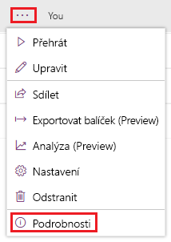
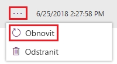

Microsoft PowerApps vám pomůže, pokud jste uložili změny aplikace, které jste ukládat neměli, nebo se pokazilo něco jiného.Microsoft PowerApps can help you out if you saved changes to an app that you shouldn't have or if something else goes wrong. U aplikací uložených v cloudu uchovává PowerApps historii provedených změn.For apps that you save in the cloud, PowerApps keeps a history of the changes that you make. Jednotlivé uložené verze si můžete zobrazit a v případě potřeby obnovit předchozí verzi aplikace.You can view each version that you've saved and restore your app to a previous version if necessary. Pokud jste aplikaci nasdíleli a potom znovu publikovali obnovenou verzi, dostanou ji také ostatní uživatelé, se kterými ji sdílíte.If you shared the app, the people you shared it with will also receive the restored version if you publish the app again.

## Zobrazení verzí aplikaceView versions of your app

1. Na portálu [web.powerapps.com](http://web.powerapps.com) vyberte u levého okraje položku **Aplikace**.On [web.powerapps.com](http://web.powerapps.com), select **Apps** near the left edge.

1. V seznamu aplikací vyberte tlačítko se třemi tečkami (**...**) a pak vyberte **Podrobnosti**.In the list of apps, select ellipsis (**...**), and then select **Details**.

    

1. Vyberte kartu **Verze**.Select the **Versions** tab.

    Na této kartě se zobrazí všechny verze aplikace, které jste uložili během jejího vývoje.The tab shows all versions of your app that you saved as you developed the app.

## Obnovení předchozí verzeRestore a previous version

1. Vyberte tři tečky (**...**) a pak vyberte **Obnovit**.Select an ellipsis (**...**), and then select **Restore**.

    

1. Dalším výběrem **Obnovit** akci potvrďte.Select **Restore** again to confirm the action.

    Do seznamu se přidá nová verze.A new version is added to your list.

Při obnovení verze aplikace získá nově obnovená verze nové, vyšší číslo verze. Obnovená verze se zobrazí na začátku seznamu.When you restore a version of an app, the newly restored version gets a new, incremented version number and appears at the top of the list. Nová verze nikdy nepřepíše předchozí verzi.A new version never overwrites a previous version.

Už víte, jak prohlížet verze aplikací, a v případě potřeby je umíte obnovit, takže můžeme přejít k další lekci, ve které se naučíte sdílet aplikace.Now that you know how to view versions of your apps and restore them if necessary, let's move on to the next unit, where you'll learn how to share your apps.