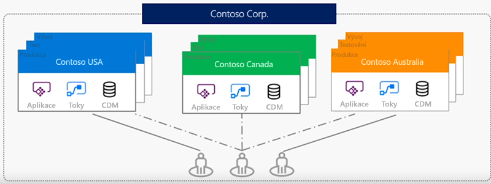
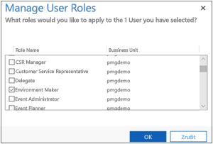

Prostředí je kontejner pro aplikace a další prostředky, jako jsou datová připojení a toky z Microsoft Flow.An environment is a container for apps and other resources, such as data connections and flows from Microsoft Flow. Je to způsob, jak vše seskupit podle firemních potřeb.It's a way to group things based on business requirements.

Pokud jste doposud postupovali podle tohoto modulu, strávili jste už nějakou dobu na https://web.powerapps.com.If you've followed along with this module so far, you've spent some time working in https://web.powerapps.com. Ať už jste to věděli, nebo ne, pracovali jste celou dobu v konkrétním prostředí.Whether you knew it or not, you've been working in a specific environment the whole time.

Aktuální prostředí se zobrazuje poblíž pravého horního rohu domovské stránky web.powerapps.com.In the upper-right corner of the web.powerapps.com home page, you can see your current environment.

Pokud jste v Microsoft PowerApps poprvé, možná je v tomto okamžiku k dispozici jenom výchozí prostředí.If you're new to Microsoft PowerApps, you might have only the default environment at this point.

- Otevřete nabídku, abyste zjistili, jestli jsou k dispozici další prostředí.Open the menu to see whether other environments are available.
 
> [!NOTE]
> Lidé, kteří potřebují pracovat s prostředími PowerApps, potřebují licenci pro PowerApps – plán 2 nebo bezplatnou zkušební verzi tohoto plánu.People who need to work with PowerApps environments need a PowerApps Plan 2 license or the free PowerApps Plan 2 trial. Navíc platí, že pokud chcete pracovat s entitami omezenými na Dynamics 365, musíte mít licenci na PowerApps pro Dynamics 365.Additionally, if you want to work with Dynamics 365 restricted entities, you must have PowerApps for Dynamics 365 license. Další informace o [licencích pro Dynamics 365](https://na01.safelinks.protection.outlook.com/?url=https%3A%2F%2Fdocs.microsoft.com%2Fen-us%2Fpowerapps%2Fadministrator%2Fpricing-billing-skus%23licenses&data=02%7C01%7Cv-tosis%40microsoft.com%7C3bb58d639d8745c27ff908d62d4c1062%7C72f988bf86f141af91ab2d7cd011db47%7C1%7C0%7C636746202048937165&sdata=8rDKLL4XBkwCLOrpZe0F2MlTmkfhAmukrV3bn4a34NU%3D&reserved=0)Learn more about [licenses for Dynamics 365](https://na01.safelinks.protection.outlook.com/?url=https%3A%2F%2Fdocs.microsoft.com%2Fen-us%2Fpowerapps%2Fadministrator%2Fpricing-billing-skus%23licenses&data=02%7C01%7Cv-tosis%40microsoft.com%7C3bb58d639d8745c27ff908d62d4c1062%7C72f988bf86f141af91ab2d7cd011db47%7C1%7C0%7C636746202048937165&sdata=8rDKLL4XBkwCLOrpZe0F2MlTmkfhAmukrV3bn4a34NU%3D&reserved=0).

## Proč používat prostředí?Why use environments?
Tady je několik důvodů, proč kromě výchozího prostředí vytvořit i další:There are several reasons to create environments beyond the default one:

- **Rozdělení vývoje aplikací podle jednotlivých oddělení:** Ve velké organizaci může každé oddělení fungovat v jiném prostředí.**Separate app development by department**: In a large organization, each department can work in a different environment. Zaměstnanci oddělení tak vidí jenom aplikace a firemní data odpovídající jejich potřebám.That way, department employees see only apps and company data that are appropriate to their needs.
- **Podpora správy životního cyklu aplikací (ALM):** Samostatná prostředí umožňují oddělit aplikace, které jsou ve fázích vývoje, od těch, které se už sdílejí.**Support application lifecycle management (ALM)**: Separate environments let you separate apps that are in development stages from those that have already been shared. Možná byste také chtěli použít zkušební prostředí, abyste před uvedením hotové aplikace získali zpětnou vazbu od zaměstnanců.Or you might want to use a trial environment so that you can gain feedback from employees before rolling out the final app. Pro některé organizace může zobrazení aplikací, které ještě nejsou úplně vyvinuté a publikované, představovat bezpečnostní problémy.For some organizations, showing apps before they're completely developed and published can present security concerns.
- **Správa přístupu k datům:** Každé prostředí může mít vlastní zdroj obchodních dat nazývaný databáze pro Common Data Service pro aplikace.**Manage data access**: Each environment can have its own source of business data, called a  database for Common Data Service for Apps. Ostatní datová připojení jsou specifická pro konkrétní prostředí a nedají se sdílet mezi různými prostředími.Other data connections are specific to an environment and can't be shared across environments.

> [!NOTE]
> Pamatujte, že prostředí jsou relevantní jenom pro tvůrce aplikací a správce PowerApps.Keep in mind that environments are relevant only to app creators and PowerApps admins. Když sdílíte aplikaci s uživateli, ti ji jenom spouštějí, pokud mají správná oprávnění.When you share an app with users, those users just run the app, provided that they have the correct permissions. Nemusejí se starat o to, z jakého prostředí aplikace pochází.They don't have to worry about what environment the app came from.

## Vytvoření prostředíCreate an environment

Prostředí může vytvářet jenom správce.Only an admin can create environments. Tyto informace můžou být pro vás užitečné, i když nejste správcem, protože s ním budete moct probrat nastavení prostředí.If you aren't an admin, this information can still be helpful when you talk to your admin about setting up environments.

1. Na domovské stránce web.powerapps.com vyberte v pravém horním rohu ikonu ozubeného kolečka a pak vyberte **Centrum pro správu**.On the web.powerapps.com home page, select the gear icon near the upper-right corner, and then select **Admin center**.

    Můžete také přejít přímo na admin.powerapps.com.You can also go directly to admin.powerapps.com.

2. V Centru pro správu PowerApps vyberte **Nové prostředí**.In the PowerApps admin center, select **New environment**. 
3. V dialogovém okně **Nové prostředí** zadejte název prostředí a pak vyberte oblast a typ prostředí.In the **New environment** dialog box, enter a name for the environment, and then select a region and an environment type.
4. Vyberte **Vytvořit prostředí**.Select **Create environment**.
1. Vyberte měnu a jazyk pro data uložená v databázi.
Select the currency and language for the data stored in the database. Po vytvoření databáze není možné měnu ani jazyk změnit.You cannot change the currency or language once the database is created. 
1. Vyberte **Vytvořit databázi**.Select **Create database**.
    Vytvoření databáze v rámci služby Common Data Service může několik minut trvat.It may take several minutes to create the database on the Common Data Service. Po vytvoření databáze se nové prostředí zobrazí v seznamu prostředí na stránce **Prostředí**.Once the database is created, the new environment appears in the list of environments on the **Environments** page.

A je to.That's it. Teď máte nové prostředí, ve kterém můžete pracovat.You now have a new environment to work in. Pokud se vrátíte na web.powerapps.com, uvidíte ho v seznamu prostředí.If you go back to web.powerapps.com, you'll see it in the environments list.

## Správa přístupu k prostředíManage access to an environment

Ve výchozím nastavení můžete získat přístup k prostředí jedním ze dvou způsobů:By default, you can access an environment in one of two ways:

- **Správce systému:** Správce systému má úplná oprávnění k vytváření a správě prostředí.**System admin**: A system admin has full permissions to create and manage environments.
- **Tvůrce prostředí:** Tvůrce prostředí může zobrazit všechny aplikace v prostředí, vytvářet aplikace a pracovat s Common Data Service pro aplikace (na to se vztahují další oprávnění).**Environment maker**: An environment maker can see all apps in that environment, create apps, and work with Common Data Service for Apps (other permissions apply).

Správci můžou podle potřeby vytvořit další role zabezpečení a podle následujícího popisu k nim přiřadit uživatele.Admins can create other security roles as needed and, as this procedure describes, assign users to them.

1. U levého okraje vyberte **Prostředí**.Near the left edge, select **Environments**.
2. Vyberte prostředí a pak vyberte **Spravovat zabezpečení pro tuto instanci**.Select an environment, and then select **Manage security for this instance.**
3. Do vyhledávacího pole poblíž pravého horního rohu zadejte nebo vložte e-mailovou adresu osoby, které chcete udělit přístup.In the search box near the upper-right corner, type or paste the email address of the person you want to grant access to.
4. Nastavte ukazatel myši na požadovaný výsledek, zaškrtněte jeho políčko a potom vyberte **Spravovat role**.Hover over the result that you want, select its check box, and then select **Manage roles**.
5. V poli **Spravovat role uživatelů** vyberte typy rolí pro uživatele.In the **Manage User Roles** box, select the types of roles for the user. V tomto příkladu se uživateli přiřadila role Environment Maker (Tvůrce prostředí).In this example, the user has been assigned to the Environment Maker role.

    

6. Vyberte **OK**.Select **OK**.

V této lekci jsme si vysvětlili, jaké mají prostředí výhody, jak je můžete vytvářet a jak se k nim uděluje přístup.This unit explained what the benefits of environments are, how to create them, and how to grant access to them. I když nejste správcem, může být užitečné vědět, jak to funguje.Even if you aren't an admin, it can be helpful to know how this works.