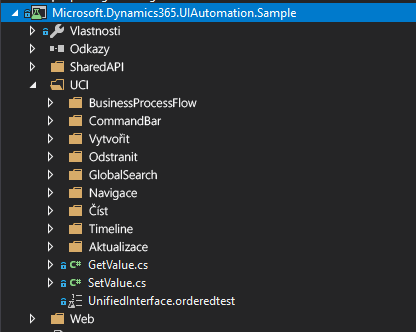

EasyRepro je knihovna nástrojů od Microsoftu, která zákazníkům služby Dynamics umožňuje usnadnit automatizované testování uživatelského rozhraní pro projekty.EasyRepro is a library of tools from Microsft to provide Dynamics customers the ability to facilitate automated UI testing for projects. Poskytované funkce pokrývají základní příkazy, které by koncoví uživatelé prováděli během obvyklého pracovního dne, a pracujeme na rozšíření tohoto pokrytí.The functionality provided covers the core commands that end users would perform on a typical workday and working to extend that coverage to more functionality. EasyRepro podporuje testování pro Dynamics 365 verze 8.1 a vyšší.EasyRepro supports testing for Dynamics 365 versions 8.1 and higher.

---

## Ukázkové testySample Tests
K dispozici je více než 100 standardních testů pro Webového klienta a více než 50 testů pro Sjednocené rozhraní.Over 100 standard tests for the Web Client and over 50 tests for the Unified Interface are available. Banka ukázkových testů zahrnuje situace s vytvářením, načítáním, aktualizováním a odstraňováním pro více entit včetně kontaktů, příležitostí, zákazníků, zájemců a případů.The sample test bank covers create, retrieve, update, and delete scenarios for multiple entities including contacts, opportunities, accounts, leads, and cases. Díky tomu získáte možnost snadno spouštět a vytvářet vlastní testy pomocí banky testů, která vám bude sloužit jako počáteční základna kódu.This provides you the ability to easily run and start creating customized tests using the test bank as your initial code base. Máte snadný přístup k předdefinovaným testům v každé konkrétní funkční oblasti, kterou testujete.You can easily access the pre-defined tests within each of the specific functional areas you are testing.

--- 

## PokrytíCoverage

### Zahrnuté funkceFunctionality Covered

- Zeď se záznamy aktivityActivity Record Wall

- Tok obchodního procesuBusiness Process Flow

- GrafyCharts

- Panel příkazůCommand bar

- Řídicí panelyDashboards

- Entity (vytvoření, aktualizace, odstranění, odstranění duplicit, přiřazení)Entities (Create, Update, Delete, Duplicate Detection, Assign)

- Globální vyhledáváníGlobal Search

- Pomoc s asistencíGuided Help

- MřížkyGrids

- PodmřížkySub-Grids

- NavigaceNavigation

- OznámeníNotifications

- Centrum výkonuPerformance Center

- Rychlé vytvořeníQuick Create

- Spuštěné pracovní postupyRun Workflows

- Spuštěné sestavyRun Reports

### Nezahrnuté funkceFunctionality Not Covered

- Oblast nastavení (správa)Settings Area (Administration)

- Vlastní nastaveníCustomization

- Spuštění dotazu Rozšířené hledání (k dispozici je otevření rozšířeného hledání)Advanced Find Query execution (Open Advanced Find is available)

- Export do ExceluExport to Excel

- ŠablonyTemplates

- Další doplňkové aplikaceOther Add-on Applications

I když nejsou žádné specifické příkazy pro výše uvedené funkce, máte obecné příkazy, s kterými můžete i tak s těmito funkcemi pracovat.Although there are not specific commands to cover the above functionality, you do have generic commands that will allow you to still interact with those features.

EasyRepro je sice k dispozici pro všechny, pokud ho ale budete chtít používat, budete potřebovat Visual Studio a pravděpodobně i pomoc od vývojáře.Though EasyRepro is available to all, using it requires the use of Visual Studio and will likely require developer assistance. 
