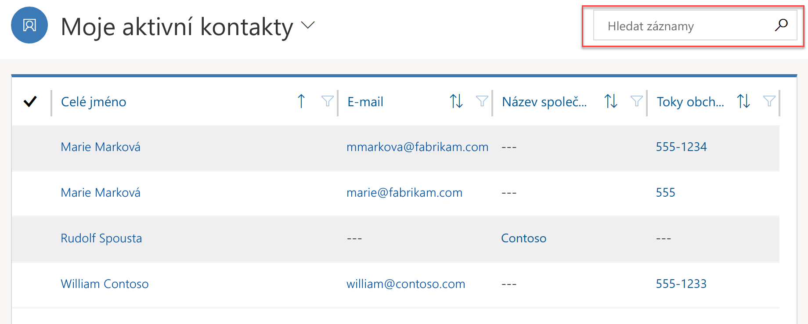
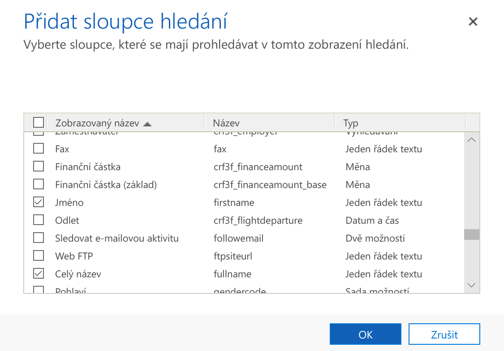
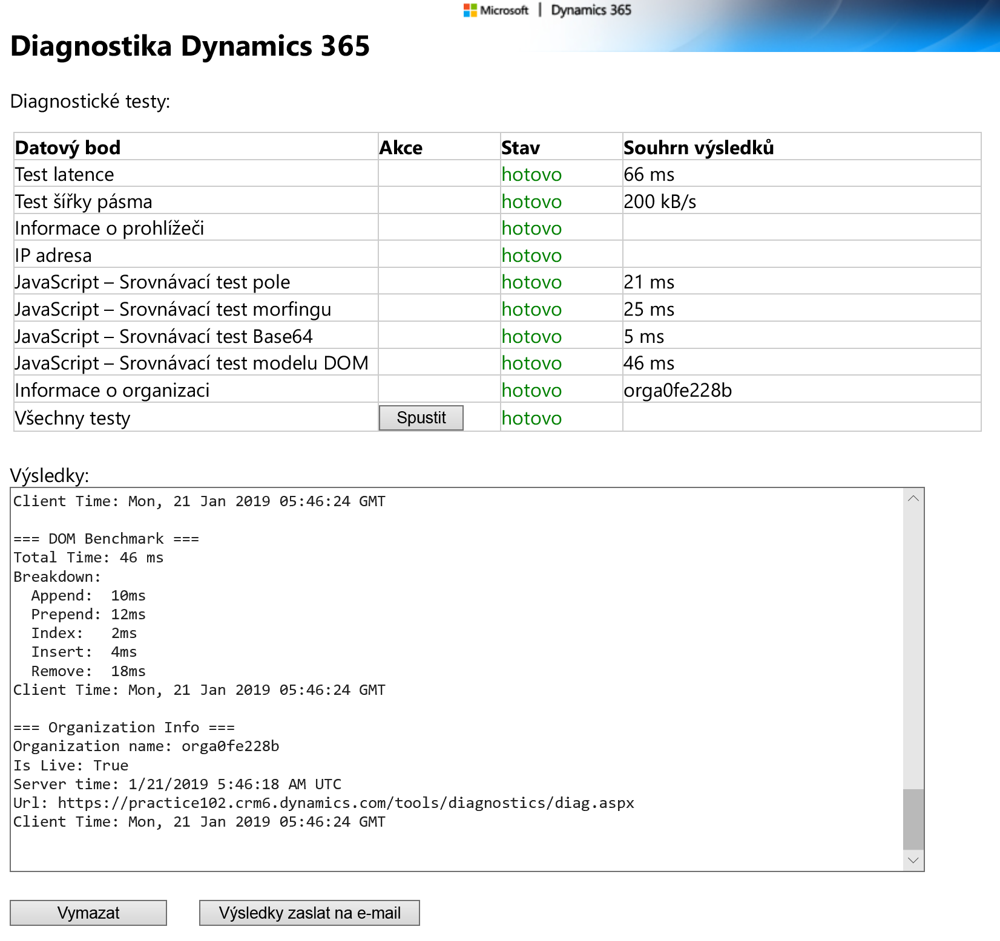
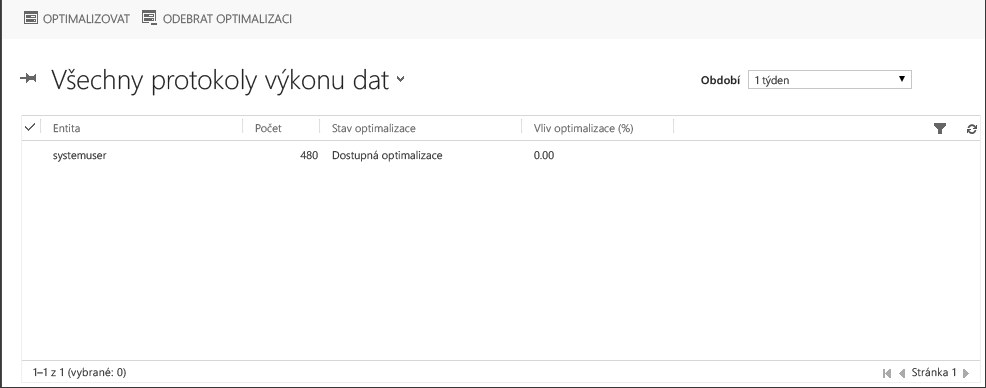
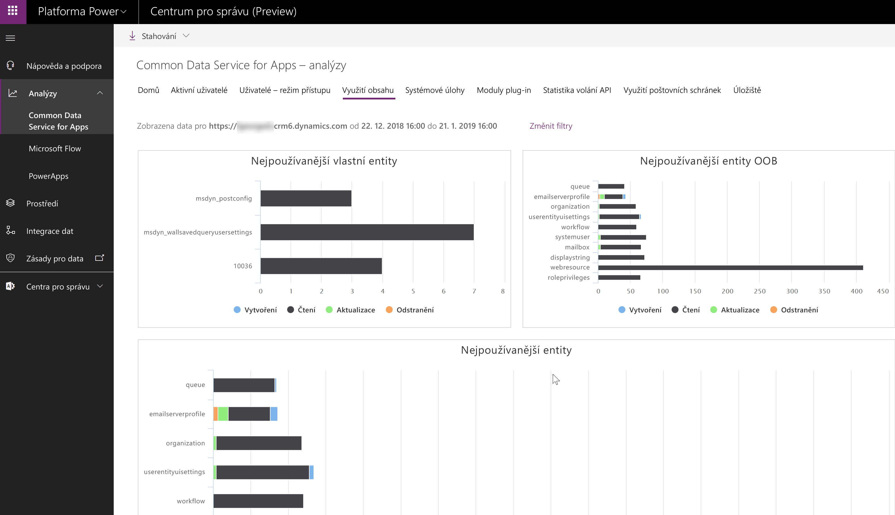
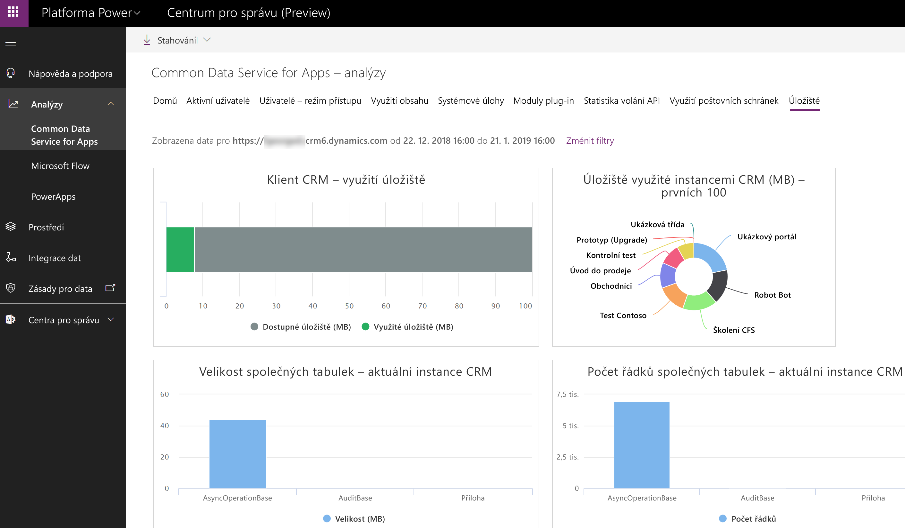

Při analýze výkonu služby Common Data Service for Apps je důležité pochopit, které oblasti mají dopad na výkon aplikace.When analyzing performance of Common Data Service for Apps, it is important to understand areas affecting the performance of an app. 

## ProstředíEnvironment

Pečlivým prozkoumáním různých faktorů prostředí můžete vylepšit celkové možnosti s aplikacemi CDS, ještě než se začnou používat ve firmě.By carefully examining various environmental factors you can improve your overall experience with CDS apps, even before your business begins to use it.

### SíťNetwork

Kapacita sítě může výrazně ovlivnit výkon aplikací z hlediska koncového uživatele.Network capacity can greatly affect performance of the apps from the end-user point of view. Patří sem webové aplikace, aplikace Dynamics 365 for Outlook a vlastní aplikace používající webové rozhraní API.That includes web apps, Dynamics 365 for Outlook app, and custom applications using Web API.

Existují dvě primární vlastnosti sítí, které mají dopad na výkon: šířka pásma a latence sítě.There are two primary network characteristics affecting the performance: network bandwidth and latency. Spolupráce s týmem sítě je nezbytná, aby se zajistilo, aby konfigurace sítě byla odpovídající a neměla negativní vliv na výkon aplikace.Collaboration with your network team is essential to making sure that network configuration is adequate and does not affect app performance.

### Konfigurace klientaClient Configuration

Aplikace služby CDS jsou webové aplikace a používají webové prohlížeče, jako je například Microsoft Edge nebo Chrome, jako uživatelské rozhraní pro zobrazování, přidávání nebo úpravy informací, které jste uložili v databázi aplikace.CDS apps are web-based applications and use web browsers, such as Edge or Chrome, as the user interface to view, add, or edit information that you’ve stored in the apps database. Možná se budete muset obrátit na správce systému, aby bylo zajištěno, že klientské počítače a nastavení softwaru jsou optimalizované pro výkon.You may need to work with your system administrators to make sure that the client machines and software settings are optimized for performance. 

## Výkon aplikaceApp Performance

Návrh samotné aplikace může výrazně ovlivnit výkon.Design of the app itself can greatly affect performance. Jednou z výhod platformy Power je schopnost rychle vytvářet robustní malé aplikace zaměřené na konkrétní uživatele a konkrétní funkce.One of the strengths of the Power platform is ability to quickly build robust small apps targeting specific users and specific functionality. Místo monolitické aplikace, která bude s větší pravděpodobností trpět problémy s výkonem, teď máte možnost navrhnout několik samostatných aplikací.Instead of a monolithic app that is more likely to suffer from performance issues you now have the ability to design several separate apps. Toto rozdělení zajišťuje, že se dá každá aplikace analyzovat a ladit nezávisle bez příliš velkého dopadu na ostatní.This separation ensures that each app can be analyzed and tuned independently without too much impact on the others.

Výkon aplikace také můžou ovlivnit techniky návrhu pro jednotlivé komponenty.Design techniques for individual components may also affect performance of an app.

### Modelem řízené aplikaceModel-driven Apps

#### FormulářeForms

Pokud chcete zvýšit výkon formulářů, navrhněte je tak, aby obsahovaly jenom informace nezbytné pro uživatele.To improve form performance, design them so that only the information essential for the users is included. Pokud požadované informace závisí na roli uživatele, je vhodné vytvořit více formulářů místo jednoho monolitického formuláře, který obsahuje každičké pole.If information required depends on the user’s role, consider creating multiple forms instead of one monolithic form that includes every single field. Skrytí karet a oddílů, které nemusí být okamžitě viditelné, může také zvýšit výkon a rychlost odezvy formuláře.Hiding tabs and sections that are not required to be immediately visible can also improve form responsiveness and performance.

Jedním z nejběžnějších zdrojů problémů s výkonem na formulářích jsou vlastní skripty přidané vývojáři.One of the most common sources of performance issues on the forms is custom scripts added by developers. Dobrá spolupráce v rámci týmu je klíčem k identifikaci a řešení případných kritických bodů výkonu, které vznikly při vývoji.Good collaboration within the team is a key to identify and resolve any performance bottlenecks introduced during the development. 

#### ZobrazeníViews

Jestli chcete zlepšit výkon zobrazování entit, omezte počet zobrazovaných sloupců jenom na ty, které podnik vyžaduje.To improve performance of the entity views, limit the number of columns displayed only to those required by the business. Často tak jde o nalezení rovnováhy mezi rychlostí reakce a zobrazováním dostatečného množství informací a následnou lepší využitelností zobrazení.As often the case, it’s a balance between the responsiveness and bringing enough information to improve usability of the view. 

Přizpůsobte zobrazení tak, aby vracela užitečný počet záznamů.Customize your views so that they bring back an actionable number of records. Například zobrazení Aktivní kontakty může obsahovat stovky tisíc záznamů, zatímco Moje aktivní kontakty toto zobrazení omezí jenom na kontakty, které vlastní daný uživatel.For example, Active Contacts view may contain hundreds of thousands of records while My Active Contacts will limit that view only to the contacts that are owned by the user. Zároveň zvažte omezení počtu záznamů na stránku tak, aby zobrazení vracela odpověď mnohem rychleji.At the same time consider limiting the number of records per page so that the views return much more quickly.

#### Rychlé vyhledáváníQuick Search

Optimalizace zobrazení rychlého vyhledávání jenom na zobrazení sloupců, které dávají smysl pro hledání, způsobí výrazný rozdíl ve výkonu hledání v rámci zobrazení.Optimizing the quick search view only to include columns that makes sense to search will make a noticeable performance impact on searches within the views. 

Pokud uživatel vyhledá záznamy v rámci zobrazení, služba CDS for Apps provede dotaz, který prohledá pouze předdefinovaná pole.When a user searches for records within a view, CDS for Apps performs a query that searches only predefined fields. Prohledávaná pole se určují nastavením Najít sloupce v Rychlém zobrazení systému.Which fields are searched is defined by the Find Columns settings in the system Quick View.

 

Čím méně sloupců je vybraných, tím rychlejší bude rychlé hledání.The fewer number of columns that are selected, the faster quick search will be. Vyvažte počet sloupců hledání s efektivitou hledání.Balance the number of find columns with the effectiveness of the search.

### Aplikace plátnaCanvas Apps

Primární zdroj problémů s výkonem v aplikacích plátna jsou špatně navržený přístup k datům, nadměrné nebo neoptimální používání vzorců a celkově složité uživatelské rozhraní.The primary source of performance issues in canvas apps are poorly designed data access, excessive or suboptimal formula use, and overly complex user interface.

#### Načítání datLoading Data

Výkon aplikací bude slabý, když se většina těžké práce bude dělat na straně klienta a ne na serveru.Apps will perform poorly when most of the heavy lifting is done on the client and not on the server. Chybná volba způsobu zadávání dotazů na data může vést k problémům s výkonem.Erroneous choice of how to query your data may lead to performance issues. Pochopit [delegování](https://docs.microsoft.com/powerapps/maker/canvas-apps/delegation-overview) v aplikacích plátna je klíčem k vylepšení výkonu aplikací, pokud jde o přístup k datům.Understanding [delegation](https://docs.microsoft.com/powerapps/maker/canvas-apps/delegation-overview) in canvas apps is the key to improving you app performance when it comes to data access.

Existují některé funkce aplikací plátna, které je vhodné vzít v úvahu při optimalizaci výkonu spuštění vaší aplikace pomocí funkce Souběžné, kterou můžete načíst data z více zdrojů souběžně.There are some canvas apps features that you would want to consider when optimizing your app start performance by using Concurrent function to load data from multiple sources concurrently. 

#### Optimalizace ovládacích prvkůControls Optimization

Dalším aspektem, který může mít vliv na výkon, je počet obrazovek a ovládacích prvků používaných ve vaší aplikaci.Another aspect that can affect performance is the number of screens and controls used in your app. Minimalizace počtu ovládacích prvků a zjednodušení používaných ovládacích prvků může přispět ke zvýšení výkonu vaší aplikace.Minimizing the number of controls and reducing complexity of the controls used can help boost your app performance. Pomůže to zvýšit výkon a zároveň i vytvářet aplikaci.It will improve the performance while authoring the app as well. Existují strategie optimalizace počtu ovládacích prvků používaných ve vaší aplikaci.There are strategies to optimizing the number of controls used in your app. Například můžete použít ovládací prvek galerie místo plátna/datové karty, když jsou data zobrazena jednotně nebo se jen mírně liší.For example, you can use a gallery control instead of a Canvas/Data Cards when the data displayed is uniform or vary only slightly. Galerie umí prostředí krásně zjednodušit, a to zase usnadňuje údržbu vaší aplikace.Gallery can be powerful in reducing complexity, making your app easier to maintain.

Dají se využít i další techniky optimalizace, tak vývojářům aplikací plátna připomeňte, aby si důkladně prošli [podrobnou dokumentaci](https://docs.microsoft.com/powerapps/maker/canvas-apps/performance-tips).There are other optimizations techniques available, make sure that canvas apps developers familiarize themselves with [detailed documentation](https://docs.microsoft.com/powerapps/maker/canvas-apps/performance-tips).

### Pracovní postupyWorkflows 

Pracovní postupy v reálném čase můžou být velice efektivní, ale pokud jsou navržené špatně, budou mít dopad na výkon nejběžnějších operací, jako je například vytváření nebo aktualizace záznamu.Real-time workflows can be very effective but, if designed poorly, will affect the performance of the most common operations such as creating or updating a record. Doporučujeme převést pracovní postupy se slabým výkonem nebo dlouhotrvající pracovní postupy na pracovní postupy na pozadí, kde bude dopad na systém menší.Consider converting poorly performing or long running workflows to background ones where the impact on the system will be smaller.

Pracovní postupy na pozadí vytvoří záznam protokolu, když se provede instance pracovního postupu.Background workflows create a log record when an instance of the workflow is executed. Ve výchozím nastavení se položky protokolu pro úspěšně provedené pracovní postupy odstraňují.The default setting is to delete log entries for successfully executed workflows. Pokud toto nastavení změníte tak, aby se položky ponechávaly, protokol úloh naroste a může dosáhnout bodu, kdy to bude mít vliv na výkon asynchronních služeb.If this setting is changed to keep the entries, jobs log will grow and may reach the point where it affects performance of the asynchronous services. Tento příznak používejte jenom pro řešení potíží a nenechávejte ho aktivní v produkčním prostředí.Only use this flag for troubleshooting and avoid leaving it on in production.

### Moduly plug-inPlugins

Vlastní rozšíření, jako jsou moduly plug-in, jsou běžné příčiny problémů s výkonem.Custom extensions such as plugins are the common source of the performance issues. Obraťte se na vývojáře a tyto problémy spolu identifikujte a vyřešte.Work with developers to identify and resolve those.

## Testování výkonnostiPerformance Testing

Navrhování s ohledem na výkon je důležitou součástí procesu a stejně tak důležité je testování výkonu.Designing for performance is an important part of the process and so is performance testing. Je důležité testovat výkon v systému, kde jsou data blízko vašeho produkčního systému.It is important to perform performance testing on the system where the volume of data is close to your production system. To vám poskytne dobrý přehled o výkonu aplikace obecně a o oblastech, které je třeba optimalizovat.That will give you a good understanding for app performance in general and for the areas to optimize. Pomocí funkce pro kopírování instance můžete vytvořit kopii instance produkčního prostředí, včetně dat.Use the instance copy function to create a copy of the production instance including the data. 

Ten druhý důležitý aspekt řádného testování výkonu je reprodukce úloh očekávaných v produkčním prostředí.The other important aspect of adequate performance testing is to reproduce workloads expected in the production environment. Testovací prostředí, kde se systémem pracuje několik testerů, a instance produkčního prostředí, kde můžou najednou se systémem pracovat stovky a tisíce uživatelů, často nejsou propojené.There is often a disconnect between testing environments where the system is accessed by a handful of the testers and the production instance where hundreds and thousands of users may access the system at the same time. Existují nástroje pro zátěžové testování, které jsou k dispozici od Microsoftu a jiných dodavatelů, a vy budete muset spolupracovat s vaším vývojářským týmem a zajistit, aby tyto nástroje byly nainstalované, nakonfigurované a používané odpovídajícím způsobem v rámci životního cyklu vývoje.There are load testing tools available from Microsoft and third-party vendors and you will need to collaborate with your development team to ensure that the tools are installed, configured, and used appropriately within the development lifecycle.

## Statistika instancíInstance Statistics

Analytické funkce CDS for Apps jsou k dispozici prostřednictvím centra pro správu platformy Power [https://aka.ms/ppac](https://aka.ms/ppac).CDS for Apps analytics are available via Power platform admin center [https://aka.ms/ppac](https://aka.ms/ppac). Obsahuje různé statistické údaje, které vám můžou pomoct identifikovat potenciální oblasti pro hlubší analýzu výkonu, například nejpoužívanější entity, spotřebované úložiště, neúspěšné úlohy a moduly plug-in systému atd.It contains various statistics that can help identify potential areas for deeper performance analysis, for example most used entities, storage consumed, failing system jobs and plugins, etc. 

## Výkon dotazůQuery Performance

CDS for Apps je služba a jako jakákoliv jiná služba nemusí vyhovovat vašemu konkrétnímu návrhu aplikace.CDS for Apps is a service and, as any service, may not cater for your specific app design. Specifické dotazy ve vaší aplikaci můžou způsobit problémy s výkonem.Specific queries in your app may cause some performance issues. Nemáte sice přímý přístup ke komponentám služby CDS for Apps, například databázi, existují ale nástroje dostupné v rámci CDS for Apps, které vám pomůžou optimalizovat prostředí podle vašich konkrétních potřeb.While you don’t have direct access to the components of the CDS for Apps such as database, there are tools available within CDS for Apps to help in tuning the environment to your specific needs. Můžete analyzovat a optimalizovat výkon dotazů pomocí zobrazení Výkon dat popsáného podrobně v dalším tématu.You can analyze and optimize query performance using the Data Performance view discussed in detail in the next topic.
Existuje několik nástrojů, které vám můžou pomoct s různými aspekty PowerApps pro optimalizaci výkonu.There are a number of tools that can assist in performance tuning various aspects of PowerApps.

## Diagnostika Dynamics 365Dynamics 365 Diagnostics

Existují dvě primární vlastnosti sítí, které mají dopad na výkon: šířka pásma a latence sítě.There are two primary network characteristics affecting the performance: network bandwidth and latency. Zjistěte, jestli tyto vlastnosti můžou mít vliv na výkon vaší aplikace, pomocí nástroje Diagnostika Dynamics 365, který je k dispozici na https://&lt;myorg&gt;.crm.dynamics.com/tools/diagnostics/diag.aspx, kde &lt;myorg&gt;.crm.dynamics.com je adresa URL vaší organizace využívající Dynamics 365.Identify if these may impact your app performance, by using the Dynamics 365 Diagnostics tool that is available at https://&lt;myorg&gt;.crm.dynamics.com/tools/diagnostics/diag.aspx where &lt;myorg&gt;.crm.dynamics.com is the URL of your Dynamics 365 organization.

Po otevření stránky a stisknutí Spustit se zpřístupní sestava, která vašemu týmu sítě pomůže při zjišťování a řešení problémů.After opening the page and pressing Run, the report will become available that will assist your network team in detecting and resolving the issues. Statistika zahrnuje některé srovnávací testy prohlížeče, které můžou být užitečné při určování, pokud je problém s výkonem prohlížeče.The statistic includes some browser benchmarks that may be useful in identifying if browser performance is an issue.

## Protokoly výkonu datData Performance Logs

Můžete analyzovat a optimalizovat výkon dotazů pomocí zobrazení Výkon dat, které poskytuje souhrnný seznam entit s dlouhotrvajícími dotazy.You can analyze and optimize query performance using the Data Performance view, which provides an aggregated list of entities with long-running queries. Dlouhotrvající dotaz se definuje jako dotaz, jehož provedení trvá tři sekundy nebo déle.A long running query is defined as a query that takes three seconds or longer to complete. Typické příklady komponenty, která může mít dlouhotrvající dotaz, je modul plug-in s vlastním FetchXML nebo podmřížka nebo zobrazení.Typical examples of a component that can have a long running query is a plug-in with custom FetchXML or a sub-grid or view. 

S protokoly Výkon dat můžete pracovat přes možnosti Nastavení -> Správa -> Výkon dat.You can access Data Performance Logs via Settings -> Administration -> Data Performance.

Pokud se zjistí jeden nebo více dlouhotrvajících dotazů entity, zobrazí se v zobrazení položky protokolu.If one or more long running entity queries are detected, log items are displayed in the view. Příkazem Optimalizovat můžete použít optimalizace na vybraný dotaz.You can use the Optimize command to apply optimizations to the selected query.

> [!Note]
> Díky nejnovějším vylepšením funkcí pro automatické ladění databáze Azure SQL už asi žádné dlouhotrvající dotazy v zobrazení Výkon dat neuvidíte hlášené.With the most recent advances in Azure SQL database self-tuning capabilities you may no longer see any long running queries reported in the Data Performance view. Pomalé dotazy se automaticky zjistí a optimalizují na úrovni databáze.Slow queries are automatically detected and optimized at the database level. 

## AnalýzyAnalytics

Analytické funkce CDS for Apps jsou k dispozici prostřednictvím centra pro správu platformy Power [https://aka.ms/ppac](https://aka.ms/ppac).CDS for Apps analytics are available via the Power platform admin center [https://aka.ms/ppac](https://aka.ms/ppac). Různé statistické údaje můžou pomoct určit potenciální oblasti vhodné pro hlubší analýzu výkonu.Various statistics can help identifying potential areas for deeper performance analysis.

### Common Data Service for AppsCommon Data Service for Apps

Karta Využití obsahu obsahuje informace o nejpoužívanějších předpřipravených a vlastních entitách.The Content Usage tab contains information about most used out-of-the-box and custom entities. Určení nejpoužívanějších entit pomáhá soustředit optimalizační úsilí na ty části aplikace, na kterých záleží.Identifying the most used entities helps concentrate the optimization efforts on the parts of the app that matter.

Karta Úložiště poskytuje řadu statistik o úložišti napříč všemi instancemi tenantů jako i rozpis úložiště v rámci vybrané instance.The Storage tab provides a number of storage statistics across all of your tenant instances as well as breakdown of the storage within the selected instance. 

To může pomoct identifikovat entity s nadměrným využíváním úložiště, které by byly primární cíl pro další šetření ohledně výkonu.This can help identify entities with excessive storage use that would be a primary target for further performance investigations.

Jsou k dispozici také další statistiky, které můžou být užitečné.Other statistics are also available that may be useful. Statistiky modulů plug-in můžou pomoct při identifikaci problémových modulů plug-in, například těch, které mají nadměrnou průměrnou dobu provádění.Plug-ins statistics can assist in identifying troublesome plugins, for example those with excessive average execution time.

### PowerApps AnalyticsPowerApps Analytics

PowerApps Analytics pomáhá s analýzou výkonu tím, že poskytuje podrobné statistiky o výkonu služby přes různé konektory používané ve vaší aplikaci.PowerApps Analytics help with performance analysis by providing detailed statistics on Service Performance across various connectors used in your app. 

Další informace, třeba celkové využití aplikace, statistika polohy nebo chyby zobrazené koncovým uživatelům, se dají vyčíst z ostatních karet.Additional information such as overall app usage, location statistics, or errors seen by end users can be extracted from other tabs. Tyto informace sice nesouvisí přímo s výkonem, ale můžou být užitečné při přesném určování celkových problematických oblastí, jejichž příčinou může být nízký výkon aplikace, například konkrétní oblast, konkrétní aplikace atd.While not directly performance related, this information can be useful in pinpointing overall problematic areas that may be caused by poor app performance such as specific region, specific app, etc.
